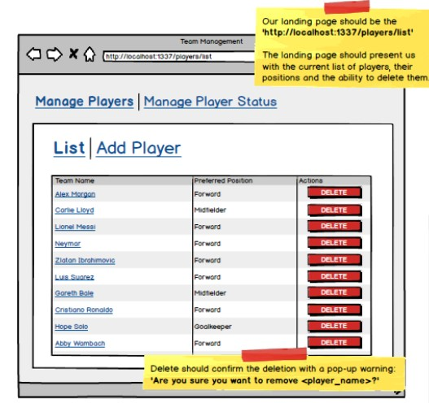
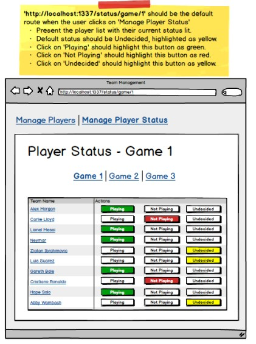
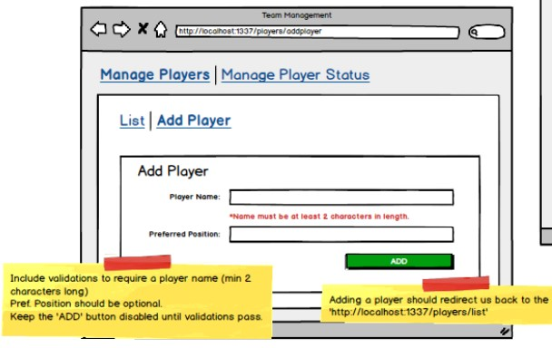

# Fro-Frame

 Fro-Frame is a website designed to help programers to start their essential front end code by building a wireframe from one side, and generate an HTML and CSS code which they can use to get started with their project. 
By that we save for you the boring process of creating or adding non original designs and templates from other websites. 
So set back, relax and let us do the job.

## Screenshots

## Tech Stack

**Client:** React, JavaScript, HTML, CSS, Bootstrap, MUI, Socket.io 

**Server:** Express, MongoDB, Node.js, Cors

## Authors

- [@Ali Rabah](https://github.com/alirabah93)
- [@Omar Salem](https://github.com/Salem15963)
- [@Marah Ashayer](https://github.com/Marah-Ashayer)
- [@Karam Taha](https://github.com/Karam-taha)

## Requirements:

- Login and Registration
- Socket.io
- Material-ui

## Documentation

[Documentation](https://docs.google.com/document/d/1zYgs7nW_bQC7KK3u1kftiVlQsSFKfxb0lDbcC-YZXXk/edit)

